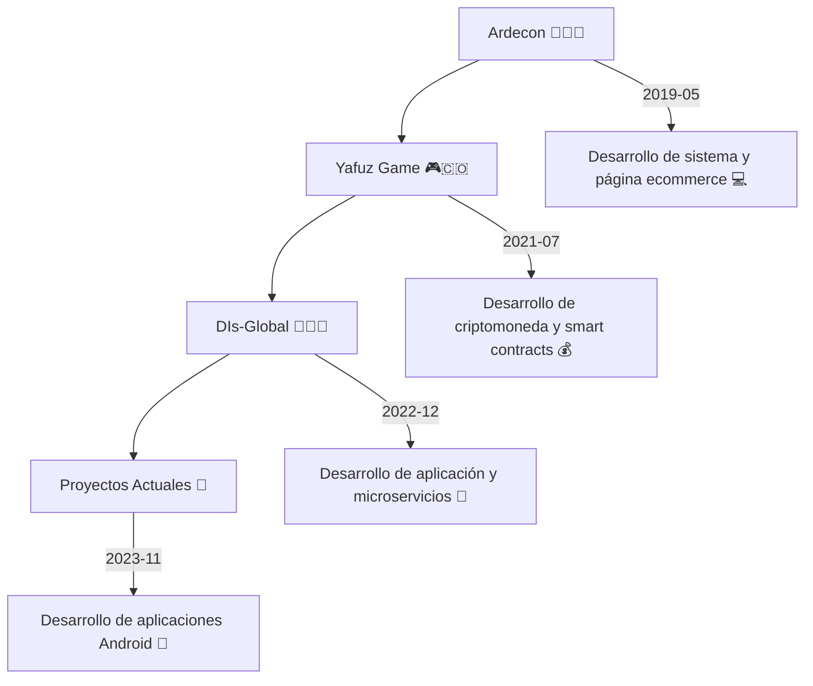
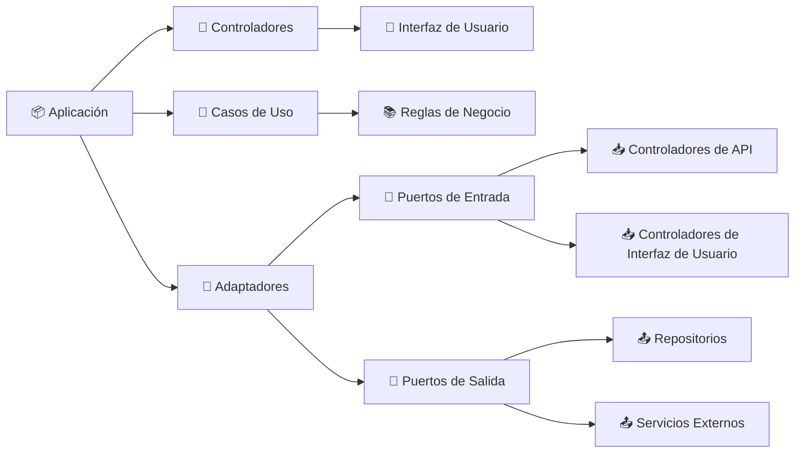

# Oscar Herrera 👨‍💻🇨🇴🇨🇴

Soy Oscar Herrera, un desarrollador Full Stack con nacionalidad venezolana y colombiana. He estudiado en el SENA un Tecnólogo en Análisis y Desarrollo de Sistemas de Información y actualmente estoy estudiando la Ingeniería en Software.

# Contacto 📞📧

Si tienes alguna pregunta o simplemente quieres contactarme, aquí te dejo mis datos:

- Teléfono: +573017982676 📞
- WhatsApp: +573017982676 📱
- Email: <osedhelu@gmail.com> 📧
- LinkedIn: [osedhelu](https://www.linkedin.com/in/osedhelu/) 🔗
- Facebook: [osedhelu](https://www.facebook.com/osedhelu) 🔗

¡Espero escuchar de ti pronto! 😊

## Experiencia Profesional 💼

### Ardecon 🏢🇨🇴

Desarrollé un sistema para la organización de la empresa y una página ecommerce para que la empresa vendiera sus artículos. Trabajé en esta empresa durante más de 2 años utilizando tecnologías como React, Node.js, TypeScript, SQL Server, Express, Nest.js, Next.js.

### Yafuz Game 🎮🇨🇴

Desarrollé una criptomoneda llamada Yaz y una empresa llamada Yafuz Game. Logramos implementar y desarrollar smart contracts para NFT, la criptomoneda, y logramos tener un capital de 10.000 USDT en menos de 3 meses.

### DIs-Global 🏢🇨🇴

Desarrollé una aplicación utilizando tecnologías como Node.js, Bun, Solidity, Web3, React, Astro para la aplicación o dashboard, Next.js para la página principal. Implementé una arquitectura en microservicios donde teníamos un servicio en Django, Node.js, Elixir, Ether.js.

## Proyectos Actuales 🚀

Actualmente, estoy desarrollando aplicaciones Android con tecnologías como Kotlin, Jetpack Compose. He desarrollado 3 microservicios en Node.js y Django, Socket.io.

## Diagrama de Tiempo 📊




## una de mis paciones es la Arquiectura hexagonal



Tengo una biblioteca que nos permite iniciar un proyecto backend. 😊 Utilizo bun y con tan solo ejecutar el siguiente comando:

```bash
bunx osedhelu project-backend
```

Ya tienes un servicio API REST. Lo más importante es la estructura de archivos y carpetas que se genera:

```
📁 src
├── 📁 app
│   └── 📁 user
│       ├── 📁 application
│       │   └── user.create.ts
│       ├── 📁 domain
│       │   └── userRepositoryImpl.ts
│       ├── 📁 infrastructure
│       │   ├── 📁 controllers
│       │   │   └── user.ctrl.ts
│       │   ├── 📁 repository
│       │   │   └── user.repository.ts
│       │   └── router.ts
│       └── user.module.ts
├── ioc.repository.ts
├── main.ts
└── 📁 utils
    ├── insertImports.ts
    ├── service-dir-arq-hexagonal.ts
    ├── 📁 templates
    │   ├── creator.template.ts
    │   ├── ctrl.template.ts
    │   ├── module.template.ts
    │   ├── repository.template.ts
    │   ├── repositoryImpl.template.ts
    │   └── router.tmp.ts
    └── text.utils.ts

```

Cada vez que creas un nuevo directorio dentro de la carpeta app, se generará automáticamente la estructura de la arquitectura hexagonal e implementará la inyección de dependencias. 😄
Here is a simple flow chart:
